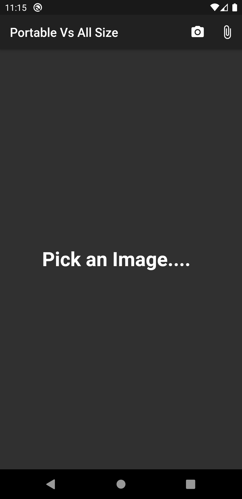
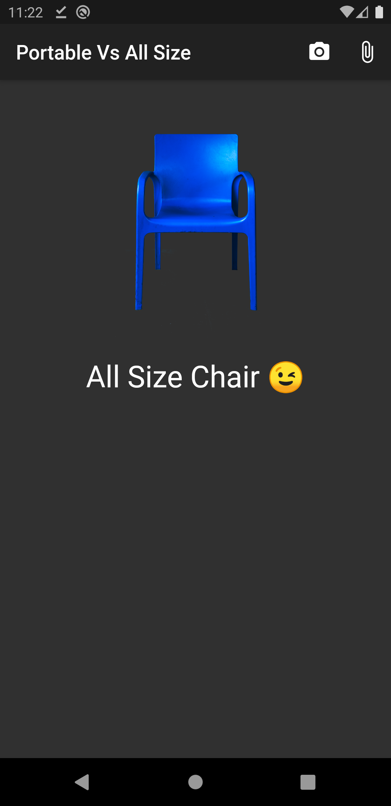

# nhop_chairs_classifier

## Background of App

So i've been working as a Business Systems Analyst at [Nice House of Plastics](https://www.nice.co.ug/) for a few months now. One of my smallest challenges was to memorize the names of Our Best Selling Chairs. i.e All Size Vs Portable. It's not a big problem but why not?

### Solution 💽

I wanted my Solution to be Simple & Fast. So i decided to work on a machine learning model and serve it through a Mobile Application. So i could always take a pic with my Phone's Camera and get the Prediction.

### How ? ☄️

To train a model, you need a lot of training data, say 1000 for each chair. The obvious method would have been to take a lot of pictures on my phone and use them as training data. After taking about 10 Pics, i realized there has to be a better way:-

-   Record a 2 Min Video of each Chair on My Phone.
-   Open the Video in Photoshop and Export each Frame of the Video as an Image
-   Use tensor flow the modeling.
-   Flutter for the Mobile Application.

{width="290"}

### Anhaa!! 🤔

The Question still remains?? Does it work?

{width="290"}

### Conclusion !

Am no expert on Machine Learning and i don't think this is the best way to do it, but it works.

You can also get yourself One of Our Chairs and Test this Application.

### What Next 

Am thinking of training a model that can do predictions on all Our Products and may be a mini recommendation engine on Our Website.

### Helpul Links

-   (Simon Sayz Website)[<https://simonsayz.xyz/>]
-   (Project Link)[<https://github.com/tagasimon/Chairs-Classifier-Flutter>]
-   (Flutter)[<https://flutter.dev/docs/get-started/codelab>]
-   (Tensor Flow)[<https://www.tensorflow.org/lite>]
